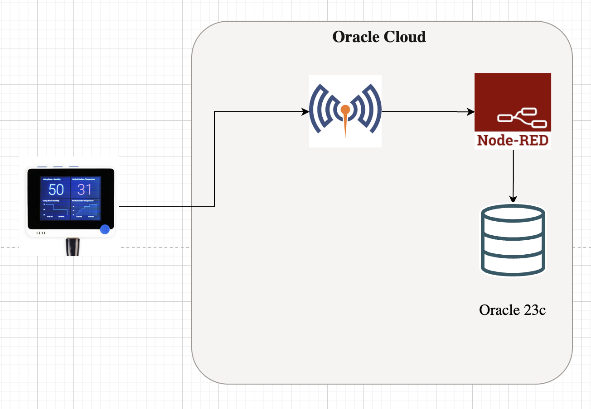
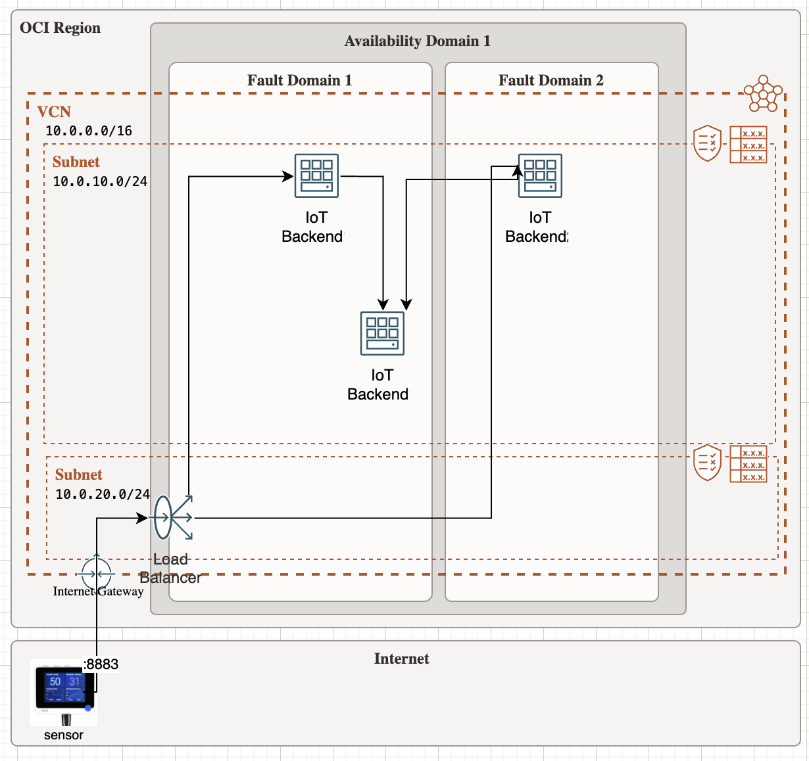

# Oracle Database 23C Free installation guide

Terraform script that helps you provision Nodered and Mosquitto server on OCI integrated into a Oracle Database 23c free edition

**NodeRed** 

Node-RED is an open-source, flow-based programming tool that enables users to create IoT applications and workflows visually. It is built on top of Node.js and provides a web-based flow editor that makes it easy to connect devices, APIs, and services. Node-RED comes with a rich set of pre-built nodes that make it easy to connect to different devices and services, including MQTT, HTTP, and WebSocket.

Oracle 23c free edition is a freely available oracle database that you can use for free readmore [here](https://www.oracle.com/database/free/)


## Logical Diagram 


## Architecture Diagram 

_*Note this is the optimum deployment diagram, however in this repo I'm provisioning everything on a single machine_

## Configuration

1. Log into cloud console 
2. Run the following 
```
git clone https://github.com/badr42/Oracle_db23cfree
cd Oracle_db23cfree
export TF_VAR_compartment_ocid='<comparment-ocid>'
#export TF_VAR_region='<home-region>'
export TF_VAR_DB_PASS=<password>


<optional>
# Select Availability Domain, zero based, if not set it defaults to 0
export TF_VAR_AD_number='0'
```

3. Execute the script generate-keys.sh to generate private key to access the instance
```
ssh-keygen -t rsa -b 2048 -N "" -f server.key
```


## Build
To build simply execute the next commands. 

```
terraform init
terraform plan
terraform apply
```

## Post Config settings
1. Log into node-red by directing your browser to instance-public-ip:1880
2. Update the oracle db node server and add in the user name and password of the nodered user created during the provisioning process 


## Connect to the DB
```
ssh -i server.key opc@instance-public-ip

#Switch to user Oracle  
sudo su - oracle 

**set the environment variables**
export ORACLE_SID=FREE 
export ORAENV_ASK=NO 
. /opt/oracle/product/23c/dbhomeFree/bin/oraenv
cd $ORACLE_HOME/bin
  
lsnrctl status
./sqlplus / as sysdba
```


## IMPORTANT 

1. Please reset the passwords 
2. I built it to be wide open you'll need to add security and ssl certificates for both node-red as well the mosquitto servers


## Trouble Shooting
1. If the script fails, try to SSH to the machine and run database.sh then install.sh 